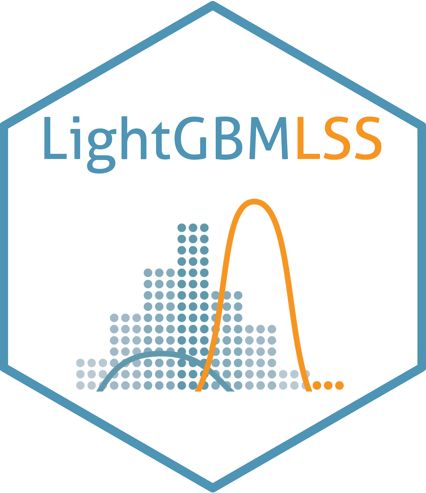

<h4 align="center">


[](https://opensource.org/licenses/Apache-2.0)


</h4>

#



# LightGBMLSS - An extension of LightGBM to probabilistic modelling and prediction
We introduce a comprehensive framework that models and predicts the full conditional distribution of a univariate target as a function of covariate. Choosing from a wide range of continuous, discrete, and mixed discrete-continuous distributions, modelling and predicting the entire conditional distribution greatly enhances the flexibility of LightGBM, as it allows to create probabilistic forecasts from which prediction intervals and quantiles of interest can be derived.

## `Features`
:white_check_mark: Estimation of all distributional parameters. <br/>
:white_check_mark: Normalizing Flows allow modelling of complex and multi-modal distributions. <br/>
:white_check_mark: Zero-Adjusted and Zero-Inflated Distributions for modelling excess of zeros in the data. <br/>
:white_check_mark: Automatic derivation of Gradients and Hessian of all distributional parameters using [PyTorch](https://pytorch.org/docs/stable/autograd.html). <br/>
:white_check_mark: Automated hyper-parameter search, including pruning, is done via [Optuna](https://optuna.org/). <br/>
:white_check_mark: The output of LightGBMLSS is explained using [SHapley Additive exPlanations](https://github.com/dsgibbons/shap). <br/>
:white_check_mark: LightGBMLSS provides full compatibility with all the features and functionality of LightGBM. <br/>
:white_check_mark: LightGBMLSS is available in Python. <br/>

## `News`
:boom: [2023-07-20] Release of v0.3.0 introduces Normalizing Flows. See the [release notes](https://github.com/StatMixedML/LightGBMLSS/releases) for an overview. <br/>
:boom: [2023-06-22] Release of v0.2.2. See the [release notes](https://github.com/StatMixedML/LightGBMLSS/releases) for an overview. <br/>
:boom: [2023-06-15] LightGBMLSS now supports Zero-Inflated and Zero-Adjusted Distributions. <br/>
:boom: [2023-05-26] Release of v0.2.1. See the [release notes](https://github.com/StatMixedML/LightGBMLSS/releases) for an overview. <br/>
:boom: [2023-05-23] Release of v0.2.0. See the [release notes](https://github.com/StatMixedML/LightGBMLSS/releases) for an overview. <br/>
:boom: [2022-01-05] LightGBMLSS now supports estimating the full predictive distribution via [Expectile Regression](https://epub.ub.uni-muenchen.de/31542/1/1471082x14561155.pdf). <br/>
:boom: [2022-01-05] LightGBMLSS now supports automatic derivation of Gradients and Hessians. <br/>
:boom: [2022-01-04] LightGBMLSS is initialized with suitable starting values to improve convergence of estimation. <br/>
:boom: [2022-01-04] LightGBMLSS v0.1.0 is released!

## `Installation`
To install LightGBMLSS please first run
```python
pip install git+https://github.com/StatMixedML/LightGBMLSS.git
```
Then, to install the shap-dependency, run
```python
pip install git+https://github.com/dsgibbons/shap.git
```

## `Available Distributions`
Our framework is built upon PyTorch and Pyro, enabling users to harness a diverse set of distributional families. LightGBMLSS currently supports the [following distributions](https://statmixedml.github.io/LightGBMLSS/distributions/).

## `How to use`
Please visit the [example section](https://statmixedml.github.io/LightGBMLSS/examples/Gaussian_Regression/) for guidance on how to use the framework.

## `Documentation`
For more information and context, please visit the [documentation](https://statmixedml.github.io/LightGBMLSS/).

## `Feedback`
We encourage you to provide feedback on how to enhance LightGBMLSS or request the implementation of additional distributions by opening a [new discussion](https://github.com/StatMixedML/LightGBMLSS/discussions).

## `Reference Paper`
[](https://arxiv.org/abs/2204.00778) <br/>
[](https://arxiv.org/abs/1907.03178) <br/>
