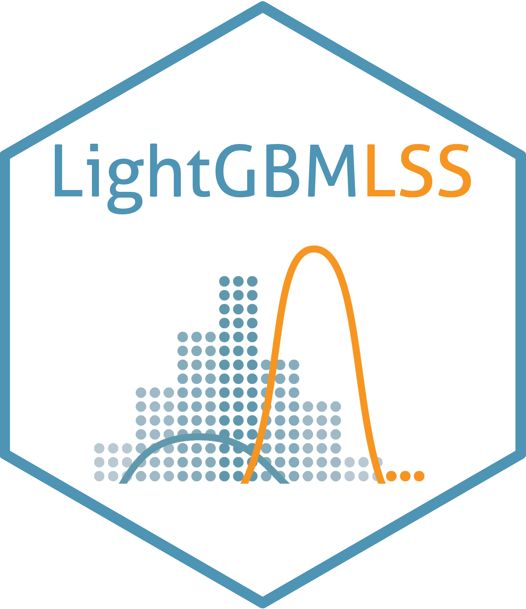

 

# LightGBMLSS - An extension of LightGBM to probabilistic modelling and prediction
We introduce a comprehensive framework that models and predicts the full conditional distribution of a univariate target as a function of covariate. Choosing from a wide range of continuous, discrete, and mixed discrete-continuous distributions, modelling and predicting the entire conditional distribution greatly enhances the flexibility of LightGBM, as it allows to create probabilistic forecasts from which prediction intervals and quantiles of interest can be derived.

## Features
- Estimation of all distributional parameters. <br/>
- Normalizing Flows allow modelling of complex and multi-modal distributions. <br/>
- Zero-Adjusted and Zero-Inflated Distributions for modelling excess of zeros in the data. <br/>
- Automatic derivation of Gradients and Hessian of all distributional parameters using [PyTorch](https://pytorch.org/docs/stable/autograd.html). <br/>
- Automated hyper-parameter search, including pruning, is done via [Optuna](https://optuna.org/). <br/>
- The output of LightGBMLSS is explained using [SHapley Additive exPlanations](https://github.com/dsgibbons/shap). <br/>
- LightGBMLSS provides full compatibility with all the features and functionality of LightGBM. <br/>
- LightGBMLSS is available in Python. <br/>

## Installation
To install LightGBMLSS, please first run
```python
pip install git+https://github.com/StatMixedML/LightGBMLSS.git
```
Then, to install the shap-dependency, run
```python
pip install git+https://github.com/dsgibbons/shap.git
```

## Some Notes
### Stabilization
Since LightGBMLSS updates the parameter estimates by optimizing Gradients and Hessians, it is important that these are comparable in magnitude for all distributional parameters. Due to variability regarding the ranges, the estimation of Gradients and Hessians might become unstable so that LightGBMLSS might not converge or might converge very slowly. To mitigate these effects, we have implemented a stabilization of Gradients and Hessians. 

For improved convergence, an alternative approach is to standardize the (continuous) response variable, such as dividing it by 100 (e.g., y/100). This approach proves especially valuable when the response range significantly differs from that of Gradients and Hessians. Nevertheless, it is essential to carefully evaluate and apply both the built-in stabilization and response standardization techniques in consideration of the specific dataset at hand.

### Runtime
Since LightGBMLSS is based on a *one vs. all estimation strategy*, where a separate tree is grown for each distributional parameter, it requires training ```[number of iterations] * [number of distributional parameters]``` trees. Hence, the runtime of LightGBMLSS is generally slightly higher for univariate distributions as compared to LightGBM, which requires training ```[number of iterations]``` trees only.

## Reference Paper
März, A. and Kneib, T.: (2022) [*Distributional Gradient Boosting Machines*](https://arxiv.org/abs/2204.00778). <br/>
März, Alexander (2019): [*XGBoostLSS - An extension of XGBoost to probabilistic forecasting*](https://arxiv.org/abs/1907.03178).
